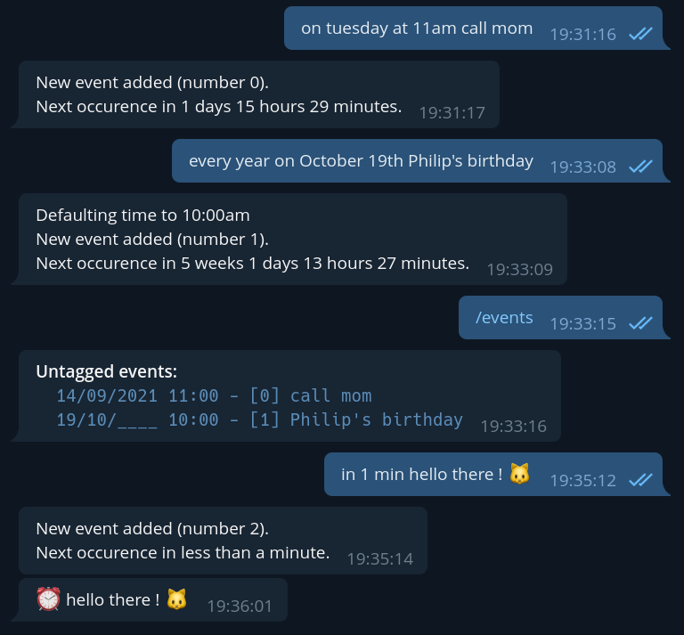

# Nag

A Telegram bot for the forgetful.



## Description

Nag is a bot whose purpose is to remind you about things. You set a message and a date, and Nag will send you a reminder at the given date. Simple as that.

For now, Nag is only designed for self-hosting and private use. You need to run it yourself on your own VPS or homelab server. It does not support multiple users (yet).

Features:
* Add new events by writing them in natural language (e.g "at 6pm pick up groceries")
* Events can be repeating (e.g "every year on January 28th Mark's birthday")
* Events can be given a tag, for easy sorting

## Building

Build from source: `cargo build --release`

If you use `cargo run` to run the program, make sure to insert `--` to prevent arguments to Nag from being eaten by cargo (e.g: `cargo run --release -- path/to/data/ --date-format=mdy`).

There are also a few tests, mainly to prevent regressions in the time parsing: `cargo test`

## Usage

Since Nag is self-hosted, you need your own Telegram bot token to run it. Thankfully obtaining one is really easy and only takes a few seconds, by following the instructions at https://core.telegram.org/bots#creating-a-new-bot.

Nag will retrieve this token from the environment variable `NAG_TELEGRAM_TOKEN`.

Nag takes takes one mandatory argument `DATA_PATH`, which is a path to the folder where user data should be stored. The folder will be created if it does not exist, but its parent folder must already exist.

Nag will use the current local time provided by the host OS, which is something to be aware of if your server is in a different timezone than you.

Once the bot is running, type `/help` for a list of available command.

**Important:** by default, Nag will assume that numerical dates are in the Day/Month format, both for understanding and displaying them. If you prefer to use the Month/Day format instead (if you're the US for example), pass the CLI argument `--date-format=mdy`.

Command-line options:

```
nag 0.1.0

Robin Lange <robin.langenc@gmail.com>

USAGE:
    nag [OPTIONS] <DATA_PATH>

ARGS:
    <DATA_PATH>    

FLAGS:
    -h, --help       Print help information
    -V, --version    Print version information

OPTIONS:
        --date-format <DATE_FORMAT>
            Day/Month/Year or Month/Day/Year.
            Affects both parsing and displaying.
             [default: dmy] [possible values: mdy, dmy]

        --http-endpoint <HTTP_ENDPOINT>
            [default: true]

        --endpoint-host <ENDPOINT_HOST>
            [default: 0.0.0.0]

        --endpoint-port <ENDPOINT_PORT>
            [default: 8123]

    -v, --verbosity <VERBOSITY>
            [default: info] [possible values: off, trace, debug, info, warn, error]
```

## HTTP endpoint

Nag has one additional feature, which is an exposed REST API letting users send messages to themselves via an HTTP endpoint. Nag will listen for any incoming POST request on a specified port (8123 by default), and relay their content verbatim to the user as Telegram messages.

The idea is to give users an easy way to create their own notifications. For example, let's assume that you need to launch a long-running task in the terminal and want to be notified when it completes. You can do this with:

```
$ ./my_long_task; curl -d "Task complete!" <host>
```

Where `<host>` points to the IP of your server and the port Nag is listening on. You can use your own public subdomain (like `notification.mydomain.xyz`), which is very convenient since it makes your notification system accessible from within any environment that has `curl`.

However, it's important to note that Nag does not handle encryption, authentication, or any kind of abuse protection, so you will have to roll your own if needed and be extra careful when sending personal data through that notification system.


## Event time examples

Nag will do a best-effort parsing of natural language to understand when notifications should be sent. A few general rules:
* if the full date is not specified, Nag will attempt to complete using the current date and time (e.g, "at 8pm" will be interpreted as "today at 8pm").
* if the time of day is not specified, it will default to 10AM.

Examples of supported specifications:

* `in January on the 1st at 10am`
* `on the 01/02/2020 at 22:00`
* `on the 01/01 in 2020`
* `in 20 minutes`
* `every year on August 1st`
* `tuesday at 11 am`
